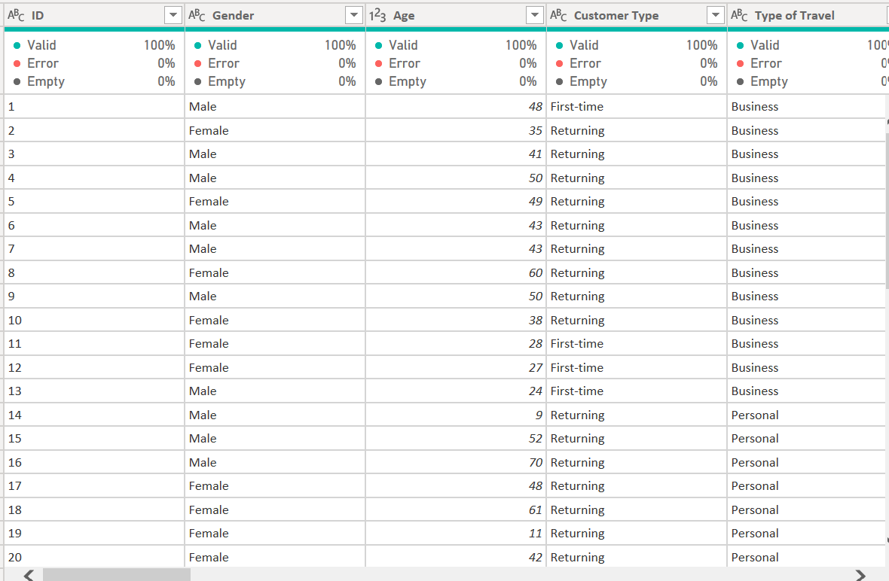
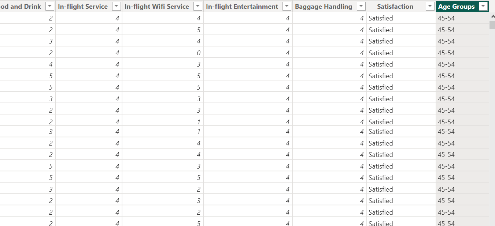
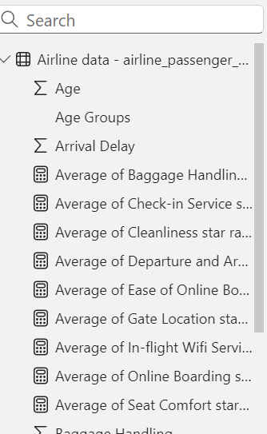
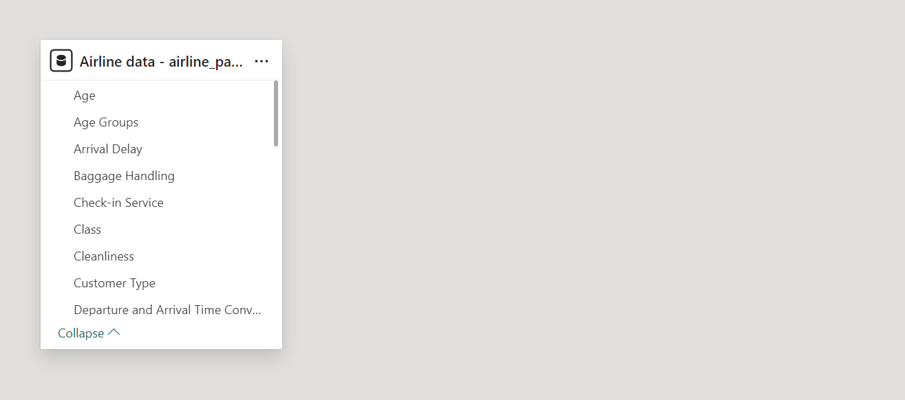
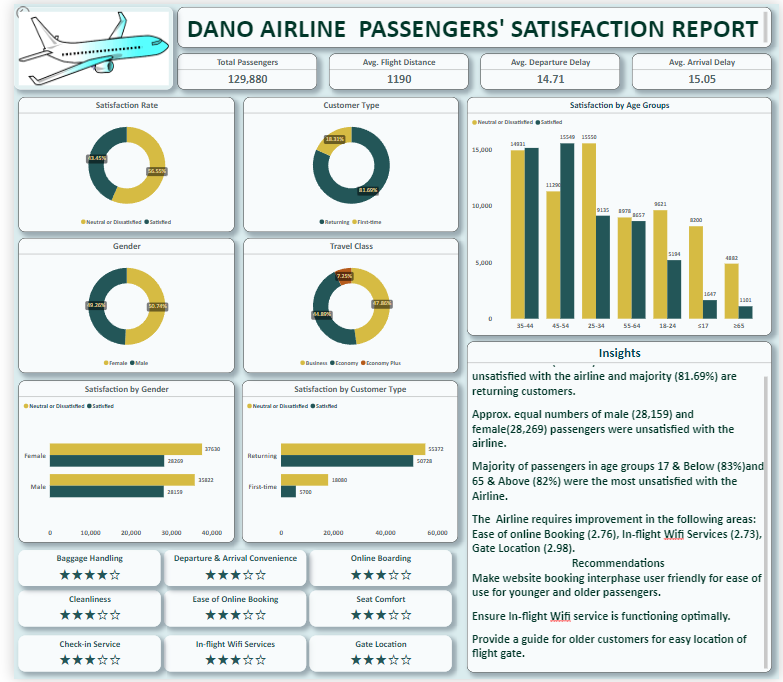

# Dano Airline Passengers' Satisfaction Report

## Introduction
This is a Power BI project to analyze latest passenger survey results for **Dano Airlines**, a Uk-based airline with headquartered in London, United Kingdom, whose satisfaction rate dipped under 50% for the first time ever. The insights from this analysis are intended to aid the leadership team focus on key areas of improvement and getting back on track. 

**_Disclaimer:_** _This is a dummy data set used to show case Power BI capabilities during my training._

## Problem Statement
1. What is the percentage satisfaction?
2. Who are the least satisfied, retuning or new passengers?
3. Which travel class of passenger's are the least satisfied?
4. What age groups of passengers are the least satisfied?
5. What areas of service are passengers most unsatisfied with?

## Data Source 
_https://docs.google.com/spreadsheets/d/15Kp-2yfQFNRGJPNOkpMwG-OMX8xVZOJ5VL7f35v7sRQ/edit#gid=1647986900_. 

The data set is a csv file which was loaded into the power BI platform. The data set contains 24 columns and 129,880 rows.

## Power BI concepts/skills applied
The following Power BI concepts were utilized.
- Power query
- Filter
- Quick Measure
  
## Data Cleaning/Transforming
1. Data was effectively cleaned and transformed using power query editor of Power BI. All columns were scrutinized and ensured there were no blank cells and all data were 100% valid and in the correct data type. The column for **'Arrival delay'** had one null value which was replaced with **'0'**.
2. It was necessary to classify the ages of the passengers into groups as they had varying ages hence a new column was created and labeled **'Age group'**.The conditional column was used to categorize the ages into seven age groups; ≤ 17, 18-24, 25-34, 35-44, 45-54, 55-64 and ≥65.
3. Star rating is visually more pleasing to rate performance/services, therefore quick measure was used to calculate the star rating for services provided by the Airline. This was achieved by selecting the star rating option, and inputting the **'Average'** for each service as the best value, then inputted the number of stars as **'5'** and inputted the lowest star rating as **'0'** and the highest star rating as **'5'**.

Power Query Editor showing the quality of the data

Age group Column created   

Data fields showing the Average Services for star rating

 
                                                                                                                           
## Data Modelling
Only one table is contained in this data set and hence there were no relationships to be established.

## Data Analysis and Visualization
The report shows the total number of passengers who participated in the survey as **129880**, highlighting the satisfation rate, travel type, class of passengers, age groups and star ratings of some the services provided by the airline.

## Insights
- A little more than half (56.55%) of the customers were unsatisfied with the airline and majority (81.69%) are returning customers.
- Approx. equal numbers of male (28,159) and female (28,269) passengers were unsatisfied with the airline.
- Majority of passengers in age groups ≤ 17 (83%) and ≥65 (82%) were the most unsatisfied with the Airline.
- The  Airline requires improvement in the following areas:  Ease of online Booking (2.76/5), In-flight Wifi Services (2.73/5),  Gate Location (2.98/5).

## Recommendations
- Make website booking interphase user friendly for ease of use for younger and older passengers.
- Ensure In-flight Wifi service is functioning optimally.
- Provide a guide for older customers for easy location of flight gate. 🙂.
